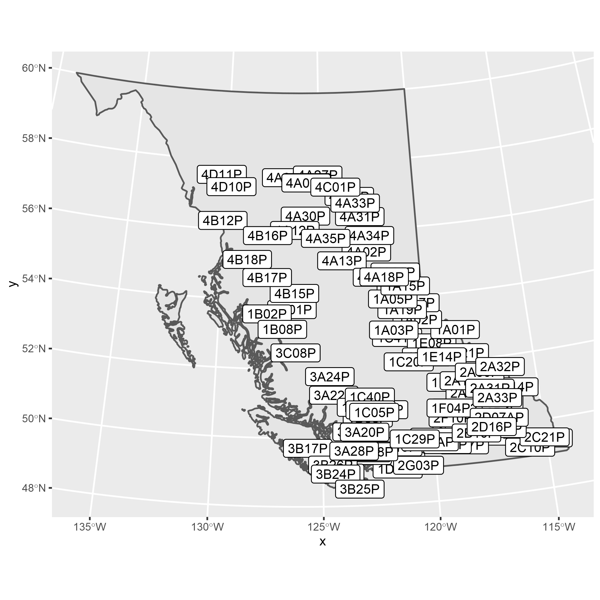
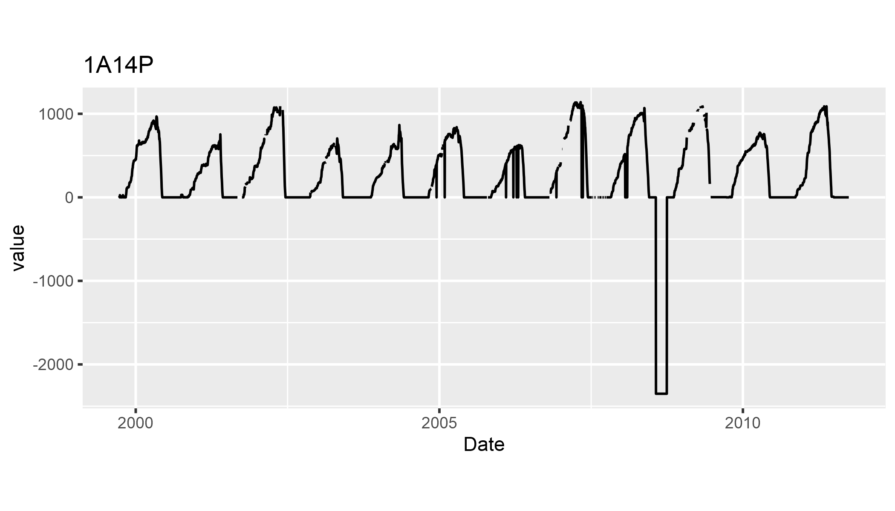
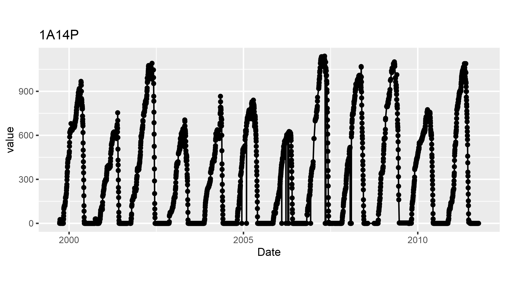
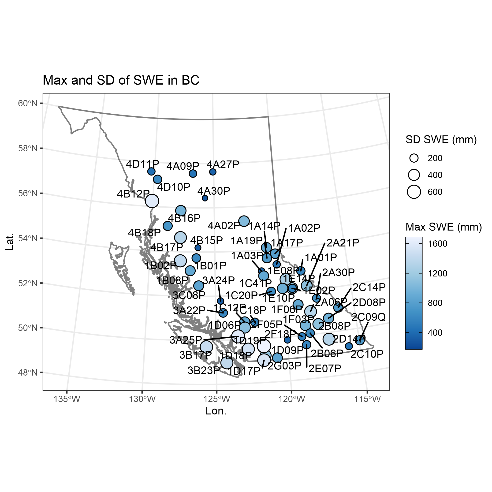
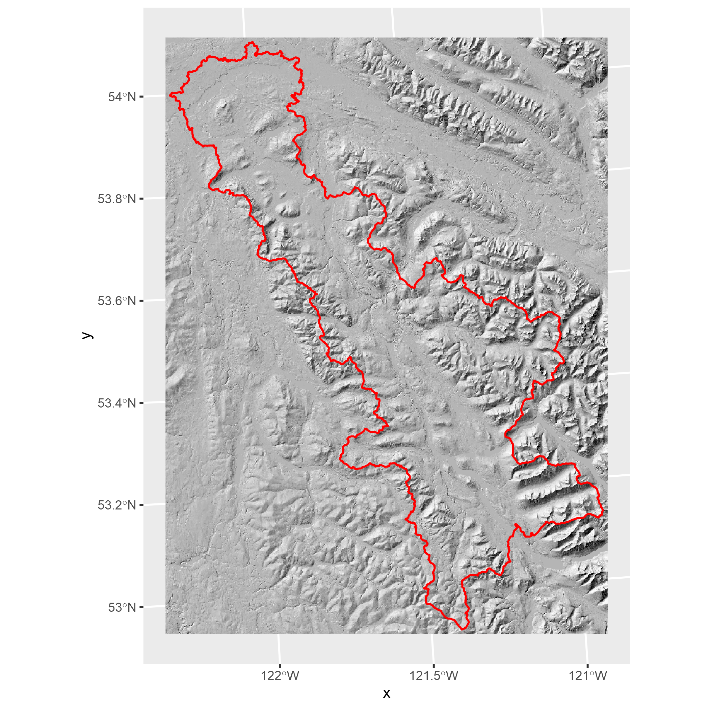

### Introduction

R is not a GIS like ArcMap or QGIS… it is generally harder to **zoom
around and check our your data**. That said, there are a lot of
advantages of using R for map making:

-   **Open source**: sharing/collaborating
-   **Reproducible**: science and decision making
-   **Efficient**: modify/recreate code between projects
-   **Data science**: integrate analysis into maps
-   **Exploration**: many tools to get to know your data

Today we will run through three examples:

1.  **Basics**: Very short intro!
2.  **Example A**: Average maximum SWE
3.  **Example B**: BEC units with a hillshade
4.  **Example C**: Satellite images

Goal:

-   Showcase examples
-   Share workflows
-   Summarise lessons learned

Audience:

-   **Beginers** for sample code and showcase
-   **Intermediate** R users for technical interest
-   **Advanced** Help me!

------------------------------------------------------------------------

### Basics

------------------------------------------------------------------------

#### Step 1 - Load libraries

    # .. getting data 
    library(bcdata)     #access to bc data catalogue
    library(bcmaps)     #handy for quick base layers (to be deprecated?)

    # .. data manipulation and plotting 
    library(ggplot2)    #plotting
    library(dplyr)      #data wrangling
    library(lubridate)  #helps with dates
    library(patchwork)  #combine multiple plots in single figure
    library(ggsn)       #add north arrow and scale bar

    # .. geospatial 
    library(sf)         #vector manipulations (see also `sp`)
    library(raster)     #raster manipulations (see also `stars`, `terra`)
    library(RStoolbox)  #useful remote sensing and raster tools

    # .. labelling
    library(ggrepel)    #label engine to avoid overlapping labels

#### Step 2 - ggplot basics

-   The **GGPLOT()**
    -   This is the canvas!
-   The **GEOM**
    -   These are the data layers
    -   Ex:
        -   geom\_point(),
        -   geom\_line(),
        -   geom\_sf(),
        -   geom\_raster(), etc.
-   The **AES()**
    -   These are the rules for how the data are plotted
    -   Map an aethetic to a variable aes(x = lon, y = lat, fill=group)
    -   Ex:
        -   x = ,
        -   y = ,
        -   color = ,
        -   fill = ,
        -   shape = , etc.
-   The **SCALE**
    -   This is how the aesthetics are represented
    -   Ex:
        -   scale\_color\_binned,
        -   scale\_x\_continuous,
        -   scale\_shape\_manual, etc.
-   The **THEME()**
    -   These allow you to format the map (Ex: format legend, aspect
        ratio, background etc.)

#### Step 3 - Let’s make a map!

    # Make Some Data (e.g. csv)
    my_data <- data.frame(
      Name = "Prince George", 
      X = -122.709,
      Y = 53.910)

    # Convert to "Simple Feature"
    my_data_sf <- st_as_sf(my_data, coords = c("X","Y"), crs = 4326)

    # Reproject
    my_data_sf_albers <- my_data_sf %>% st_transform(3005)

    # Buffer 
    my_data_sf_albers_buf <- my_data_sf_albers %>% st_buffer(3000)

    ggplot() +
      geom_sf(data = my_data_sf_albers_buf, 
              aes(fill = "30 km buffer (3005)")) +
      geom_sf(data = my_data_sf, 
              shape = 21, 
              fill = "black", 
              aes(size = "Prince George (4326)")) +
      scale_fill_manual(values = "red") +
      labs(fill = "Buffer", size = "Point", x = "Lon.", y = "Lat.") +
      coord_sf(crs = 3005) +
      theme_bw()

------------------------------------------------------------------------

### Example 1: Maximum Snow

------------------------------------------------------------------------

#### Step 2 - Outline of BC

    # Get outline of BC
    bc <- bcmaps::bc_bound()

    # Plot outline of BC
    ggplot(bc) +
      geom_sf()

    # Add a label to the map
    ggplot(bc) +
      geom_sf() +
      geom_sf_label(label = "IS THIS BRITISH COLUMBIA?")

    # Dissolve polygons to "multipolygon" and add label
    map_bc <- bc %>%
      summarise() %>% # Dissolve
      ggplot() +
        geom_sf(fill = NA, color = "grey50", size = 0.5) +
        theme_bw() +
        labs(x = "Lon.", y = "Lat.", title = "Holy smokes!")

    map_bc + geom_sf_label(label = "IS THIS BRITISH COLUMBIA?")

         # Map assigned to variable 

#### Step 3 - Where are the snow station stations?

    # Search catalogue
    bcdc_search("snow pillows")
    #> List of B.C. Data Catalogue Records
    #> 
    #> Number of records: 5
    #> Titles:
    #> 1: Automated Snow Weather Station Locations (wms, kml, other)
    #>  ID: ebe546aa-ac34-491c-a828-fdc87fb70610
    #>  Name: automated-snow-weather-station-locations
    #> 2: Current Season Automated Snow Weather Station Data (csv)
    #>  ID: 3a34bdd1-61b2-4687-8b55-c5db5e13ff50
    #>  Name: current-season-automated-snow-weather-station-data
    #> 3: Archive Automated Snow Weather Station Data (csv)
    #>  ID: 5e7acd31-b242-4f09-8a64-000af872d68f
    #>  Name: archive-automated-snow-weather-station-data
    #> 4: Meteorological Locations (other, wms, kml)
    #>  ID: 7380eb8b-66b0-4ebf-80ca-84283c4ff78a
    #>  Name: meteorological-locations
    #> 5: BC Wildfire PSTA Head Fire Intensity (other, fgdb, wms, kml)
    #>  ID: b756c2ac-e753-4771-bbb8-48c7f73d564a
    #>  Name: bc-wildfire-psta-head-fire-intensity 
    #> 
    #> Access a single record by calling bcdc_get_record(ID)
    #>       with the ID from the desired record.

    # Station locations
    asws_loc <- bcdc_query_geodata("ebe546aa-ac34-491c-a828-fdc87fb70610", crs = 3005) %>%
      filter(STATUS == "Active") %>%
      collect()

    # Plot locations
    ggplot(asws_loc) +
      geom_sf(data = bc) + 
      geom_sf_label(aes(label = LOCATION_ID))

#### Step 4 - Where are the data?

    # Get the historical data
    asws_swe_historical <- bcdc_get_data(record = '5e7acd31-b242-4f09-8a64-000af872d68f',
                                         resource = 'f4ec0b1f-f8ba-4601-8a11-cff6b6d988a4') %>%
      filter(variable == "Snow_Water_Equivalent")

    # Inspect data at a random station
    asws_swe_historical %>%
      filter(Pillow_ID == "1A14P") %>% 
      ggplot() + 
        geom_line(aes(Date, value)) + 
        labs(title =  "1A14P") + 
        theme(aspect.ratio = 0.4)

    # Remove negative values
    asws_swe_historical <- asws_swe_historical %>% filter(value >= 0)

    # Inspect data again
    asws_swe_historical %>%
      filter(Pillow_ID == "1A14P") %>% 
      ggplot() + 
        geom_point(aes(Date, value)) + 
        geom_line(aes(Date, value)) + 
        labs(title =  "1A14P") + 
        theme(aspect.ratio = 0.4)

#### Step 5 - Calculate mean annual maximum SWE and plot

    # Mean annual maximum SWE
    asws_swe_historical_mean <- asws_swe_historical %>% 
      mutate(year = year(Date)) %>% 
      # Calculate MAX and SD of SWE per station/year
      group_by(Pillow_ID, year) %>% 
      summarise(max_val = max(value, na.rm = T),
                sd_val = sd(value, na.rm = T)) %>% 
      # Calculate MEAN of the annual maximum and SD per station
      group_by(Pillow_ID) %>% 
      summarise(mean_max_val = mean(max_val, na.rm = T),
                mean_sd_val = mean(sd_val, na.rm = T))

    # Join table to points
    asws_slp <- dplyr::right_join(
      x = asws_loc, 
      y = asws_swe_historical_mean %>% mutate(LOCATION_ID = Pillow_ID))

#### Step 6 - Calculate mean annual maximum SWE and plot

    # Plot!
    map_bc_swe <- map_bc +
      geom_sf(
        data = asws_slp, 
        aes(
          group = LOCATION_ID, 
          fill = mean_max_val, 
          size = mean_sd_val), 
        shape = 21) +
      scale_fill_distiller(
        palette = "Blues", 
        guide = guide_colorbar(frame.colour = "black", 
                               ticks.colour = "black", 
                               barheight = 8)) +
      labs(
        fill = "Max SWE (mm)", 
        size = "SD SWE (mm)", 
        title = "Max and SD of SWE in BC") + 
      geom_text_repel(
        data = asws_slp,
        aes(label = LOCATION_ID, geometry = geometry),
        stat = "sf_coordinates")

    map_bc_swe

#### Step 7 - Optional - Mapview and Plotly

    plotly::ggplotly(map_bc_swe)
    mapview::mapview(asws_slp, zcol = "mean_max_val")

------------------------------------------------------------------------

### Example 2 - BEC and hillshade

------------------------------------------------------------------------

#### Step 1 - Read data

    # Read Data
    bowron <- read_sf("data/bowron.sqlite")
    hs <- raster("data/hs.tif")

    # Initial Plot
    ggR(hs) + geom_sf(data = bowron, fill = NA, color = "red")

    # Import BEC data
    bec <- bcmaps::bec() 

#### Step 2 - Read BEC, calculate area, plot

    # Clip to Bowron
    bec_bow <- st_intersection(bec, bowron) 

    # Dissolve by Zone
    bec_bow_dissolve <- bec_bow %>% 
      group_by(ZONE, ZONE_NAME) %>% 
      summarise()

    # Calculate Area

    bec_bow_dissolve$area_km2 <- round(units::set_units(st_area(bec_bow_dissolve), "km2"))

    # Grab Colors
    bec_col <- tibble(ZONE=names(bec_colors()),
                      BEC_COL=bec_colors())
      
    # Join colors to polygons
    bec_bow_dissolve <- left_join(bec_bow_dissolve, bec_col) 

    # Make a map
    bec_map <- ggR(hs) + 
      geom_sf(data = bec_bow_dissolve, 
              aes(fill = ZONE_NAME), 
              alpha = 0.5, 
              show.legend = F) +
      geom_sf(data = bowron, 
              fill = NA) + 
      scale_fill_manual(values = bec_bow_dissolve$BEC_COL) +
      scale_x_continuous(expand = c(0,0)) +
      scale_y_continuous(expand = c(0,0)) +  
      labs(x = "", y = "", fill = "BEC Zone") 

    # Make a bar plot
    bec_stats <- ggplot(bec_bow_dissolve) +
      geom_col(aes(ZONE, as.numeric(area_km2), 
                   fill = ZONE_NAME)) +
      geom_text(aes(ZONE, 
                    as.numeric(area_km2), 
                    label = as.numeric(area_km2)), vjust = 0, nudge_y = 50) +
      scale_y_continuous(limits = c(0, 1900), expand = c(0,0)) +
      scale_fill_manual(values = bec_bow_dissolve$BEC_COL) +
      theme_classic() +
      theme(aspect.ratio = 0.3,
            legend.position = "bottom", 
            legend.direction = "vertical") + 
      labs(y = bquote("Total area (km"^2~")"))

    # Make a 2 panel map
    bec_map/bec_stats

------------------------------------------------------------------------

### Example 3 - Satellite Image

------------------------------------------------------------------------

Sorry not enough time to develop new content! We will follow this
tutorial:

<a href="https://github.com/bcgov/bcgov-r-geo-workshop/blob/master/20191106_Day_2_PM_Raster/03_Raster_Sentinel.Rmd" class="uri">https://github.com/bcgov/bcgov-r-geo-workshop/blob/master/20191106_Day_2_PM_Raster/03_Raster_Sentinel.Rmd</a>

### Outstanting topics

1.  Add scale bar and north arrow - see ggsn
2.  Add WMS basemap - see ggmap
3.  Save as: use ggsave()
